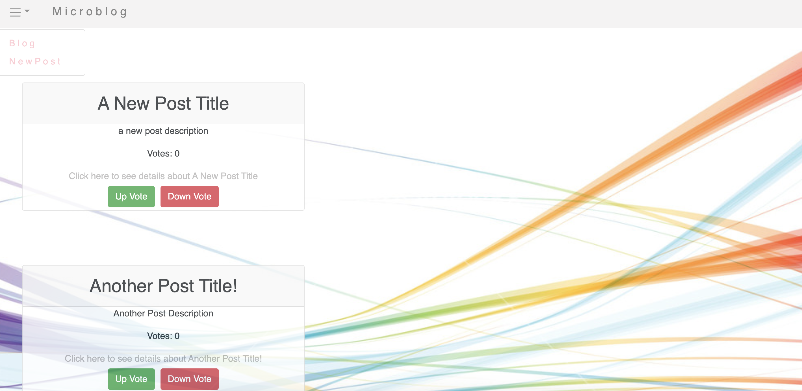
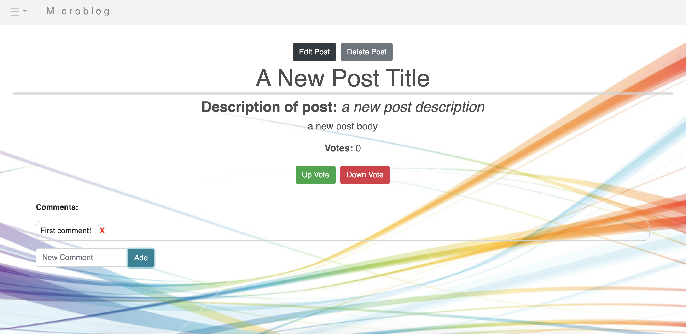
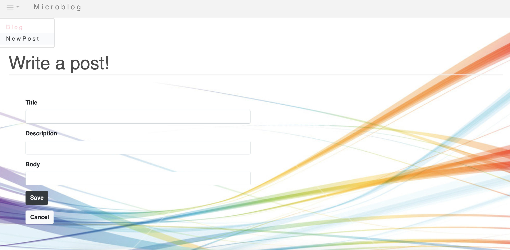

## Microblog Backend

1.  Clone this repository and `cd` into it
2.  `psql < schema.sql`
3.  `npm install`
4.  `nodemon`

All routes are prefixed with `/api` so to fetch posts the route is `GET /api/posts`

## Getting started with Microblog's frontend

1. Clone this repo and `cd` into `microblog-frontend`
2. `npm install`
3. `npm start`

## Welcome to Microblog
An innovative site for communicating on the information superhighway

# Home Page

# Show all posts
Shows all blog posts

# Post Page
Shows a specific post's details, a form to edit the post, comments on thar post

# New Post from
A form to write a new post

